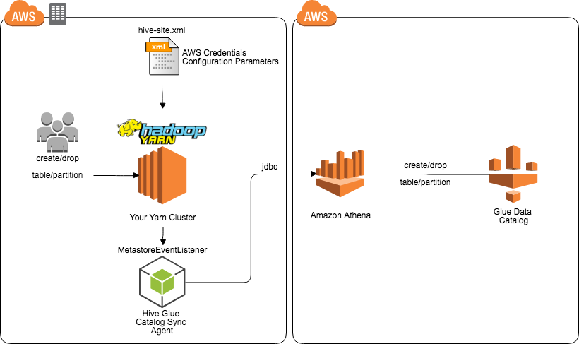

# Hive Glue Catalog Sync Agent

The Hive Glue Catalog Sync Agent is a software module that can be installed and configured within a Hive Metastore server, and provides outbound synchronisation to the [AWS Glue Data Catalog](https://aws.amazon.com/glue). This enables you to seamlessly create objects on the AWS Catalog as they are created within your existing Hadoop/Hive environment without any operational overhead or tasks.

This project provides a jar that implements the [MetastoreEventListener](https://hive.apache.org/javadocs/r1.2.2/api/org/apache/hadoop/hive/metastore/MetaStoreEventListener.html) interface of Hive to capture all create and drop events for tables and partitions in your Hive Metastore. It then connects to Amazon Athena in your AWS Account, and runs these same commands against the Glue Catalog, to provide syncronisation of the catalog over time. Your Hive Metastore and Yarn cluster can be anywhere - on the cloud or on your own data center.



Within the [HiveGlueCatalogSyncAgent](src/main/java/com/amazonaws/services/glue/catalog/HiveGlueCatalogSyncAgent.java), the DDL from metastore events is captured and written to a ConcurrentLinkedQueue. 


This queue is then drained by a separate thread that writes ddl events to Amazon Athena via a JDBC connection. This architecture ensures that if your Yarn cluster becomes disconnected from the Cloud for some reason, that Catalog events will not be dropped.

## Supported Events

Today the Catalog Sync Agent supports the following MetaStore events:

* CreateTable
* AddPartition
* DropTable
* DropPartition


## Installation

You can build the software yourself by configuring Maven and issuing `mvn package`, which will result in the binary being built to `aws-glue-catalog-sync-agent/target/HiveGlueCatalogSyncAgent-1.3.2-SNAPSHOT.jar`, or alternatively you can download the jar from [s3://awslabs-code-us-east-1/HiveGlueCatalogSyncAgent/HiveGlueCatalogSyncAgent-1.3.2-SNAPSHOT.jar](https://s3.amazonaws.com/awslabs-code-us-east-1/HiveGlueCatalogSyncAgent/HiveGlueCatalogSyncAgent-1.3.2-SNAPSHOT.jar). You can also run `mvn assembly:assembly`, which generates a mega jar including dependencies `aws-glue-catalog-sync-agent/target/HiveGlueCatalogSyncAgent-1.3.2-SNAPSHOT-complete.jar` also found [here](https://s3.amazonaws.com/awslabs-code-us-east-1/HiveGlueCatalogSyncAgent/HiveGlueCatalogSyncAgent-1.3.2-SNAPSHOT-complete.jar).

## Required Dependencies

If you install the base `HiveGlueCatalogSyncAgent-1.3.2-SNAPSHOT.jar` jar into your cluster, you must also ensure you have the following dependencies available:

* SLF4J (1.7.36+)
* Logback (1.2.3+)
* AWS Java SDK Core, Cloudwatch Logs (1.12.177+)
* org.antlr.stringtemplate (4.0.2)
* Hive Metastore (3.1.2)
* Hive Common (3.1.2)
* Hive Exec (3.1.2)

## Configuration Instructions
# S3 
Create or decide on a bucket (and a prefix) where results from Athena will be stored. You'll need to update the below IAM policy with the designated bucket.

# IAM

First, Create a new IAM policy with the following permissions (update the policy with your bucket):
	
````json
{
    "Version": "2012-10-17",
    "Statement": [
        {
            "Effect": "Allow",
            "Action": [
                "glue:CreateDatabase",
                "glue:DeleteDatabase",
                "glue:GetDatabase",
                "glue:GetDatabases",
                "glue:UpdateDatabase",
                "glue:CreateTable",
                "glue:DeleteTable",
                "glue:BatchDeleteTable",
                "glue:UpdateTable",
                "glue:GetTable",
                "glue:GetTables",
                "glue:BatchCreatePartition",
                "glue:CreatePartition",
                "glue:DeletePartition",
                "glue:BatchDeletePartition",
                "glue:UpdatePartition",
                "glue:GetPartition",
                "glue:GetPartitions",
                "glue:BatchGetPartition"
            ],
            "Resource": [
                "*"
            ]
        },
        {
            "Sid": "VisualEditor0",
            "Effect": "Allow",
            "Action": [
                "athena:*",
                "logs:CreateLogGroup"
            ],
            "Resource": "*"
        },
        {
            "Sid": "VisualEditor1",
            "Effect": "Allow",
            "Action": [
                "s3:GetBucketLocation",
                "s3:GetObject",
                "s3:ListBucket",
                "s3:ListBucketMultipartUploads",
                "s3:ListMultipartUploadParts",
                "s3:AbortMultipartUpload",
                "s3:CreateBucket",
                "s3:PutObject"
            ],
            "Resource": [
                "arn:aws:s3:::<my-bucket>",
                "arn:aws:s3:::<my-bucket>/*"
            ]
        },
        {
            "Sid": "VisualEditor2",
            "Effect": "Allow",
            "Action": [
                "logs:CreateLogStream",
                "logs:DescribeLogGroups",
                "logs:DescribeLogStreams",
                "logs:PutLogEvents"
            ],
            "Resource": "arn:aws:logs:*:*:log-group:HIVE_METADATA_SYNC:*:*"
        }
    ]
}
````

Then:

 1. Create an IAM role and attach the policy to it
 2. If your Hive Metastore runs on EC2, attach the IAM Role to this instance. Otherwise, create an IAM user and generate an access and secret key.

# Hive Configuration
Add the following keys to hive-site-xml:

- `hive.metastore.event.listeners` - com.amazonaws.services.glue.catalog.HiveGlueCatalogSyncAgent
 - `glue.catalog.athena.jdbc.url` - The url to use to connect to Athena (default: `jdbc:awsathena://athena.**us-east-1**.amazonaws.com:443`) 
 - `glue.catalog.athena.s3.staging.dir` - The bucket & prefix used to store Athena's query results
- `glue.catalog.user.key` - If not using an instance attached IAM role, the IAM access key.
- `glue.catalog.user.secret` - If not using an instance attached IAM role, the IAM access secret.
- `glue.catalog.dropTableIfExists` - Should an already existing table be dropped and created (default: true)
- `glue.catalog.createMissingDB` - Should DBs be created if they don't exist (default:true)
- `glue.catalog.athena.suppressAllDropEvents` - prevents propagation of DropTable and DropPartition events to the remote environment


Add the Glue Sync Agent's jar to HMS' classpath and restart.

You should see newly created external tables and partitions replicated to Glue Data Catalog and logs in CloudWatch Logs.


----

Apache 2.0 Software License

see [LICENSE](LICENSE) for details

